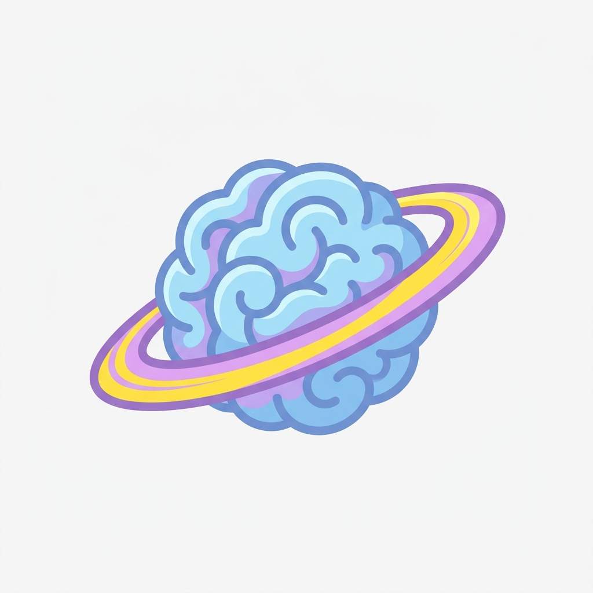
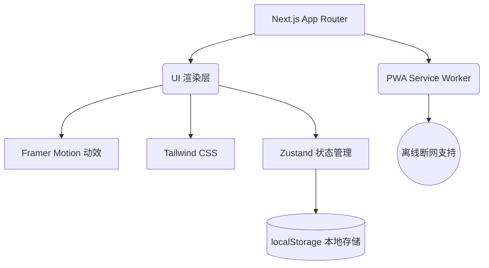

<div align="center">
  
  <h1>脑力星球 (Brain Planet) 🪐</h1>
  <p>专为 3-12 岁儿童设计的极简、开源、离线可用的幼教益智游乐园</p>
  
  <p>
    <a href="https://kids.aimake.cc"></a>
    
    
    
    
    <a href="https://github.com/chicogong/brain-planet/actions/workflows/cloudflare.yml"></a>
    <a href="https://github.com/chicogong/brain-planet/blob/master/LICENSE"></a>
  </p>
</div>

---

## 🎯 核心使命 (Mission)

做一个**无广告、无内购、无需登陆**的纯净早教平台。通过现代化的 Web 架构，提供媲美原生 App 的沉浸式体验。

### 🔐 极致的隐私安全与高性能

- **🎶 沉浸式引擎**：纯前端生成的环境背景音（BGM），零体积不耗流。
- **📊 家长数据中心**：基于 `recharts` 的可视化五维能力雷达图，时刻掌握孩子成长轨迹。
- **🚀 星际冒险地图**：多达 14 关的进阶路线，完美覆盖幼小衔接的核心能力。
- **⚡ 离线游玩**：在移动端 Safari 或 Chrome 中点击**“添加到主屏幕”**，无论是在高铁隧道还是飞机上，只要缓存过一次，断网也可随时畅玩！
- **✨ 极速性能**：深度优化的 Next.js 构建，静态导出，资源按需懒加载。

---

## 🎮 17 大核心游戏矩阵 (Game Matrix)

我们的游戏库已经扩充到 **17 款**，涵盖了从蒙氏基础启蒙到高阶数理逻辑的全方位训练：

### 1. 蒙氏启蒙 (Montessori Core)

| 游戏名称                                                                 | 推荐年龄 | 核心锻炼能力       | 图标 |
| :----------------------------------------------------------------------- | :------- | :----------------- | :--- |
| **[色彩发现者 (Color Match)](https://kids.aimake.cc/games/color-match)** | 3-6岁    | 色彩感知、专注力   | 🎨   |
| **[影子匹配 (Shadow Match)](https://kids.aimake.cc/games/shadow-match)** | 2-5岁    | 空间想象、轮廓反推 | 🦇   |
| **[分类小达人 (Sorting Master)](https://kids.aimake.cc/games/sorting)**  | 3-6岁    | 逻辑归类、多维属性 | 🍎   |

### 2. 数学与思维 (Math & Logic)

| 游戏名称                                                                       | 推荐年龄 | 核心锻炼能力       | 图标 |
| :----------------------------------------------------------------------------- | :------- | :----------------- | :--- |
| **[平衡天平 (Balance Scale)](https://kids.aimake.cc/games/balance)**           | 4-8岁    | 具象数感、等式概念 | ⚖️   |
| **[逻辑找规律 (Pattern Master)](https://kids.aimake.cc/games/pattern-master)** | 4-8岁    | 逻辑推理、序列归纳 | 🔍   |
| **[逻辑排序 (Story Sequencer)](https://kids.aimake.cc/games/sequence)**        | 4-8岁    | 叙事逻辑、因果推理 | ⏱️   |
| **[星球数独 (Sudoku 4x4)](https://kids.aimake.cc/games/sudoku)**               | 6-9岁    | 逻辑推理、全局观   | 🧩   |
| **[极限 24 点 (Math 24)](https://kids.aimake.cc/games/math-24)**               | 8-12岁   | 算术思维、快速心算 | 🧮   |

### 3. 反应与专注 (Focus & Reaction)

| 游戏名称                                                                   | 推荐年龄 | 核心锻炼能力           | 图标 |
| :------------------------------------------------------------------------- | :------- | :--------------------- | :--- |
| **[记忆翻牌 (Memory Match)](https://kids.aimake.cc/games/memory)**         | 3-8岁    | 短期记忆、空间定位     | 🦊   |
| **[舒尔特方格 (Schulte Grid)](https://kids.aimake.cc/games/schulte)**      | 4-12岁   | 专注力、视觉追踪       | 👁️   |
| **[萌宠打地鼠 (Whack-a-Mole)](https://kids.aimake.cc/games/whack-a-mole)** | 3-12岁   | 极速反应、手眼协调     | 🐹   |
| **[星际迷宫 (Space Maze)](https://kids.aimake.cc/games/maze)**             | 5-10岁   | 空间规划、全局寻路     | 🛸   |
| **[星际追踪 (Space Tracker)](https://kids.aimake.cc/games/space-tracker)** | 4-10岁   | 动态视觉追踪、工作记忆 | 👽   |

### 4. 语言与艺术 (Language & Arts)

| 游戏名称                                                             | 推荐年龄 | 核心锻炼能力       | 图标 |
| :------------------------------------------------------------------- | :------- | :----------------- | :--- |
| **[看图拼词 (Word Match)](https://kids.aimake.cc/games/word-match)** | 4-8岁    | 词汇启蒙、字母认知 | 🅰️   |
| **[魔法钢琴 (Magic Piano)](https://kids.aimake.cc/games/piano)**     | 3-10岁   | 音乐感知、自由弹奏 | 🎹   |
| **[听音辨位 (Simon Says)](https://kids.aimake.cc/games/simon)**      | 4-12岁   | 听觉记忆、序列感知 | 🎵   |

### 5. 情绪与社交 (EQ & Social)

| 游戏名称                                                               | 推荐年龄 | 核心锻炼能力       | 图标 |
| :--------------------------------------------------------------------- | :------- | :----------------- | :--- |
| **[情绪小怪兽 (Emotion Match)](https://kids.aimake.cc/games/emotion)** | 3-8岁    | 情绪识别、共情能力 | 💖   |

---

## 🏗 企业级技术底座 (Infrastructure)

这是一个拥有企业级基础设施的开源项目，包含了前端工程化的最佳实践：



### 🔍 顶级 SEO 优化与性能

- 内置自动化 `sitemap.xml` 与 `robots.txt`。
- 采用 JSON-LD 注入 `EducationalGame` Schema 结构化数据，各大搜索引擎直接抓取富媒体摘要。
- 完美适配 OpenGraph 和 Twitter Cards。
- 配置了 `lint-staged` + `husky` 钩子，保障代码提交规范。
- 剥离生产环境 Console，异步懒加载重型组件 (canvas-confetti)。

### 🚀 CI/CD 与多云部署 (Multi-Cloud)

本项目支持全静态导出 (Static Export)，支持一键部署至：

1. **Cloudflare Pages (首选)**：已内置流水线。
2. **Vercel** / **GitHub Pages** / **Zeabur**

---

## 🛠 本地开发 (Local Development)

```bash
git clone https://github.com/chicogong/brain-planet.git
cd brain-planet

# 安装依赖
npm install

# 启动开发环境
npm run dev
```

## 📁 核心目录结构 (Directory Structure)

```text
src/
├── app/
│   ├── games/        # 17款独立游戏的路由与页面
│   ├── parents/      # 家长看板数据中心
│   ├── sitemap.ts    # 动态生成的 SEO 站点地图
│   └── layout.tsx    # 全局布局与核心 SEO Meta 数据
├── components/       # 全局复用组件 (基于 shadcn/ui)
├── data/             # 静态数据 (游戏列表矩阵配置)
├── store/            # Zustand 状态管理 (PWA本地缓存)
└── lib/              # 核心工具函数与算法
```

---

## 🤝 欢迎开源共建 (Open Source Contribution)

Brain Planet 是 [Aimake Universe（爱创星球）](https://aimake.cc) 旗下的儿童产品。我们坚信儿童益智游戏天然适合社区共建。无论你是开发者、设计师还是教育工作者，都可以轻松参与进来！

### 🛡️ 核心底线

在贡献代码前，请**务必阅读**我们的 [《儿童安全与隐私设计原则》(SAFETY_PRINCIPLES.md)](SAFETY_PRINCIPLES.md)。我们对任何形式的广告、数据追踪和暗黑模式**零容忍**。

### 📜 治理模型

关于新游戏的准入标准和 PR 合并规则，请查阅 [项目治理大纲 (GOVERNANCE.md)](GOVERNANCE.md)。

### 🧩 插件式贡献指南 (Plugin-style Contribution)

本项目架构极度解耦，新增游戏只需按规范注册元数据，即可自动接入主页进度、SEO 和 PWA：

1. 在 `src/app/games/` 下新建你的游戏文件夹（如 `my-game/page.tsx`）。
2. 在 `src/data/games.ts` 中按照规范注册新游戏的元数据（如 `ageRange`, `skills`）。
3. 提交前，请使用我们准备好的 [Pull Request 模板](.github/PULL_REQUEST_TEMPLATE.md)。

如果你有了一个好点子但还没写代码，可以通过 [New Game Issue 模板](https://github.com/chicogong/brain-planet/issues/new/choose) 来提议。

> **💡 Good First Issues**: 如果你是第一次参与开源，可以在 Issues 面板中寻找打有 `good first issue` 标签的任务，通常是一些简单的 UI 调整或音效替换。

---

> **Part of [Aimake Universe](https://aimake.cc)（爱创星球）** · [Aimake Labs](https://github.com/chicogong) | Created by [Chico](https://github.com/chicogong)
