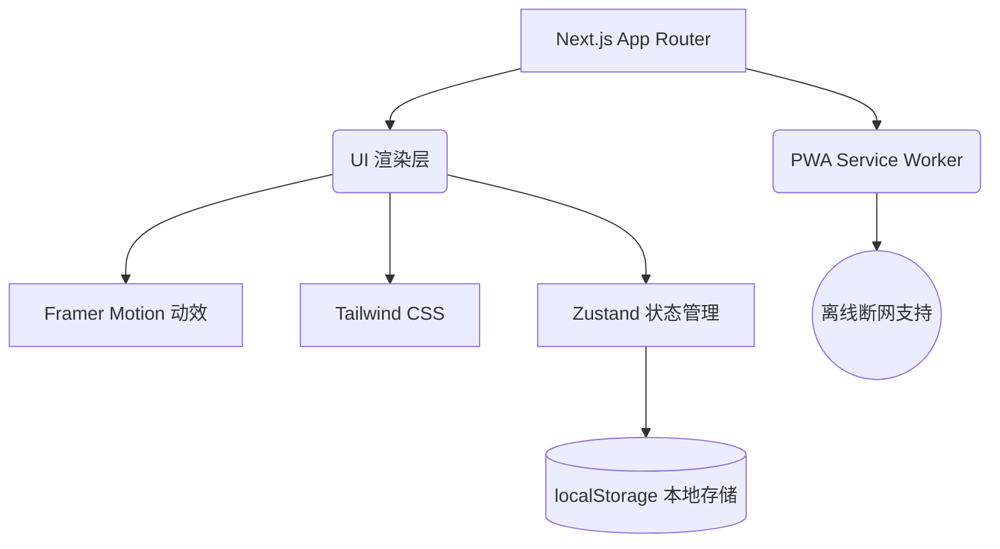

<div align="center">
  
  <h1>脑力星球 (Brain Planet) 🪐</h1>
  <p>专为 3-12 岁儿童设计的极简、开源、离线可用的益智游戏平台</p>
  
  <p>
    <a href="https://kids.aimake.cc"></a>
    
    
    
    
  </p>
</div>

---

## 🎯 核心使命 (Mission)

做一个**无广告、无内购、无需登陆**的纯净早教平台。通过现代化的 Web 架构，提供媲美原生 App 的沉浸式体验。

### 🔐 极致的隐私安全
- **零后端依赖**：本项目**不包含任何后端数据库或数据收集脚本**。
- **本地持久化**：玩家的所有积分、游戏进度均通过 `Zustand + localStorage` 存储在设备本地。

### ⚡ 随时随地，离线游玩 (PWA)
- 在移动端 Safari 或 Chrome 中点击**“添加到主屏幕”**。
- 无论是在高铁隧道还是飞机上，只要缓存过一次，断网也可随时畅玩！

---

## 🎮 游戏矩阵 (Game Matrix)

| 游戏名称 | 推荐年龄 | 核心锻炼能力 | 状态 |
| :--- | :--- | :--- | :--- |
| **色彩发现者 (Color Match)** | 3-6岁 | 色彩感知、专注力 | ✅ 已上线 |
| **极限 24 点 (Math 24)** | 8-12岁 | 算术思维、快速心算 | ✅ 已上线 |
| **星球数独 (Sudoku)** | 6-9岁 | 逻辑推理、空间记忆 | ✅ 4x4极简版上线 |
| **舒尔特方格 (Schulte Grid)**| 4-12岁 | 专注力、视觉追踪 | 🚀 研发中 |

---

## 🏗 企业级技术底座 (Infrastructure)

这是一个拥有企业级基础设施的开源项目，非常适合用作 Next.js 生产环境的学习范例。



### 🔍 顶级 SEO 优化
- 内置自动化 `sitemap.xml` 与 `robots.txt`。
- 采用 JSON-LD 注入 `EducationalGame` Schema 结构化数据，百度/Google 直接抓取富媒体摘要。
- 完美适配 OpenGraph 和 Twitter Cards，微信/TG 分享自带精美卡片。

### 🚀 CI/CD 与多云部署 (Multi-Cloud)
本项目支持全静态导出 (Static Export)，支持**零配置**一键部署至全球各大免费平台：

1. **Vercel (主力极速节点)**：内置最佳实践，支持分支预览。
2. **Cloudflare Pages (全站灾备)**：已内置 `.github/workflows/cloudflare.yml` 自动化部署流水线。
3. **GitHub Pages (免费兜底)**：已内置 `.github/workflows/nextjs.yml` 静态导出流水线。
4. **Zeabur / Netlify (国内优化)**：完全兼容静态导出，适合国内直连加速。

---

## 🛣 里程碑 (Milestones)

- [x] **v0.1: 基石构建** - Next.js 15 基础框架、色彩发现者原型。
- [x] **v0.2: 逻辑游戏** - 引入极限 24 点与星球数独。
- [x] **v0.3: PWA 改造** - 引入离线缓存机制，支持手机端一键安装至桌面。
- [x] **v0.4: 全球引流** - 深度 SEO 优化、JSON-LD 结构化数据注入、多云部署流水线。
- [ ] **v0.5: 留存裂变** - 原生 Web Share 社交分享、PWA 安装交互提示、新增舒尔特方格。*(当前阶段)*
- [ ] **v1.0: 完美出海** - 全面多语言支持 (i18n)、响应式动画深度打磨。

---

## 🛠 本地开发 (Local Development)

```bash
git clone https://github.com/chicogong/brain-planet.git
cd brain-planet

# 安装依赖
npm install

# 启动开发环境
npm run dev
```

> **Created by [Chico](https://chico.aimake.cc/)**
